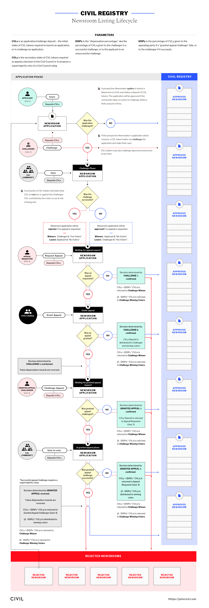

# Civil Token Curated Registry

The CivilTCR is a Token Curated Registry based on [Mike Goldin's / AdChain's original implementation](https://github.com/skmgoldin/tcr) with a few modifications:

* Listings are keyed by the address of an owned contract, rather than arbitrary hashes
* Only the owner of the contract can apply on its behalf
* After the challenge voting has ended, users can appeal (by staking tokens) to have the appellate entity consider overturning the result of a challenge
* If the appellate overturns the challenge result, that decision can be challenged by users as well (by matching the deposit in the previous step), which begins another vote that requires a supermajority in favor in order to veto the granted appeal.
* When a challenge result is overturned (the appellate granted an appeal and the appeal was either not challenged or survived the appeal challenge) the winnings for the challenge go to the original losers (e.g.: a Challenger wins a challenge 61%-39%. The Newsroom appeals the result and the appellate grants the appeal, which goes unchallenged. When the challenge is resolved, the Newsroom receives the challenge reward, with the remainder able to be claimed by the voters who were part of the original 39% minority).

A flow-chart detailing the application/listing lifecycle is included at the bottom of this page.

Documentation for contracts are generated using `doxity` and can be found at [http://dapp.staging.cvl.pub/contracts](http://dapp.staging.cvl.pub/contracts)

## Voting

Our voting system, controlled by the `CivilPLCRVoting` contract, is a Partial-Lock Commit-Reveal Voting contract based on [Mike Goldin's / ConsenSys' original implementation](https://github.com/ConsenSys/PLCRVoting) with a few modifications required to properly distribute tokens to voters when a challenge vote is overturned by the appellate:

* Added `getNumLosingTokens(address _voter, uint _pollID, uint _salt)` and `getTotalNumberOfTokensForLosingOption(uint _pollID)` since an overturned challenge treats the losers as the winners, and thus these values are needed to properly calculate payouts.

When voting within the Civil ecosystem, it's important to know what the vote options mean.

A "passed" vote is one in which the percentage of YES (1) votes is greater than the `voteQuorum` for the poll. In the event of a tie, the NO (0) side is considered the winner.

* A vote of YES (1) on a `CHALLENGE` poll means that you "support the newsroom" and believe the application/listing should be whitelisted.
* A vote of NO (0) on a `CHALLENGE` poll means that you "agree with the challenger" that the application/listing should be removed.
* A vote of YES (1) on an `APPEAL CHALLENGE` poll means that you "agree with the appeal challenger" that the granted appeal should be overturned.
* A vote of NO (0) on an `APPEAL CHALLENGE` poll means that you "agree with the appellate" and that their decision should stand.

## Parameters

The parameters used by various aspects of the CivilTCR (e.g. the length of an application) are controlled by the `CivilParameterizer` contract, based on [Mike Goldin's / AdChain's original implementation](https://github.com/skmgoldin/tcr) with 2 very minor modifications:

* Initializing a few additional parameters in the constructor to support the appeal challenge process.
* Using an array of values to initialize parameters in constructor, rather than individual constructor parameters, because the additional parameters we added were putting us over the limit for a transaction (when added as individual constructor parameters) and the contract couldn't be initialized.

## Government

The `Government` contracts (which implements `IGovernment`) controls various parameters related to the appeals process, as well as the Appellate entity address. `CivilTCR` maintains an instance of `IGovernment` originally set in the constructor, which can be updated by the "Government Controller".

This contract also maintains a reference to the hash of the current "Constitution", the document that is intended to guide participants in the system.

The `Government` parameters can be updated in a process similar to how the `Parameterizer` functions, except that new values can only be proposed by the appellate.

